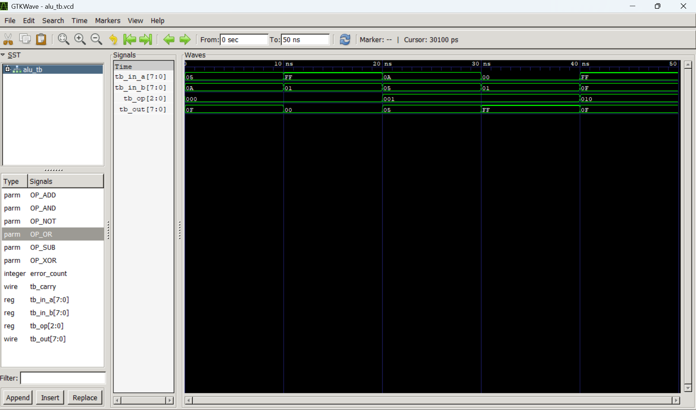

# Synthesizable 8-bit ALU with Registered I/O Wrapper

A production-grade, highly optimized 8-bit Arithmetic Logic Unit (ALU) implemented in Verilog HDL. The design features a fully combinational processing core isolated by input/output pipeline staging registers within a top-level execution module to maximize structural timing margins.

## Hardware Architecture

The core processing unit (`alu_rtl.v`) implements strict defense-in-depth combinational design rules—pre-initializing zero-state global fallbacks alongside robust case-default mapping to guarantee flawless simulation stability and completely eliminate inferred synthesis latches.

### Supported Operations
| Opcode (3-bit) | Operation | Core Function Description |
| :--- | :--- | :--- |
| `3'b000` | **ADD** | 9-bit mathematical addition extracting a dedicated Carry Out |
| `3'b001` | **SUB** | 9-bit mathematical subtraction capturing Borrow Out |
| `3'b010` | **AND** | Bitwise logical AND masking |
| `3'b011` | **OR** | Bitwise logical OR combining |
| `3'b100` | **XOR** | Bitwise logical exclusive OR toggling |
| `3'b101` | **NOT** | Bitwise logical inversion of Operand A |

---

## Verification Strategy

The design includes an automated, self-checking behavioral testbench layout (`alu_tb.v`). Instead of forcing tedious manual waveform inspection, the validation environment leverages automated mathematical validation tasks to assert RTL runtime outputs against calculated behavioral benchmarks, updating a centralized error dashboard on the fly.

### Local Simulation Walkthrough

To replicate behavioral simulation benchmarks using open-source EDA tools (Icarus Verilog and GTKWave):

```bash
# 1. Compile the tool netlist mapping
iverilog -o alu_tb.vvp alu_rtl.v alu_top.v alu_tb.v

# 2. Execute behavioral simulation engine
vvp alu_tb.vvp

# 3. Open the visual timing waveforms
gtkwave alu_tb.vcd

## Behavioral Waveform Verification

Below is the verified timing diagram from GTKWave showing correct arithmetic and logical execution:

